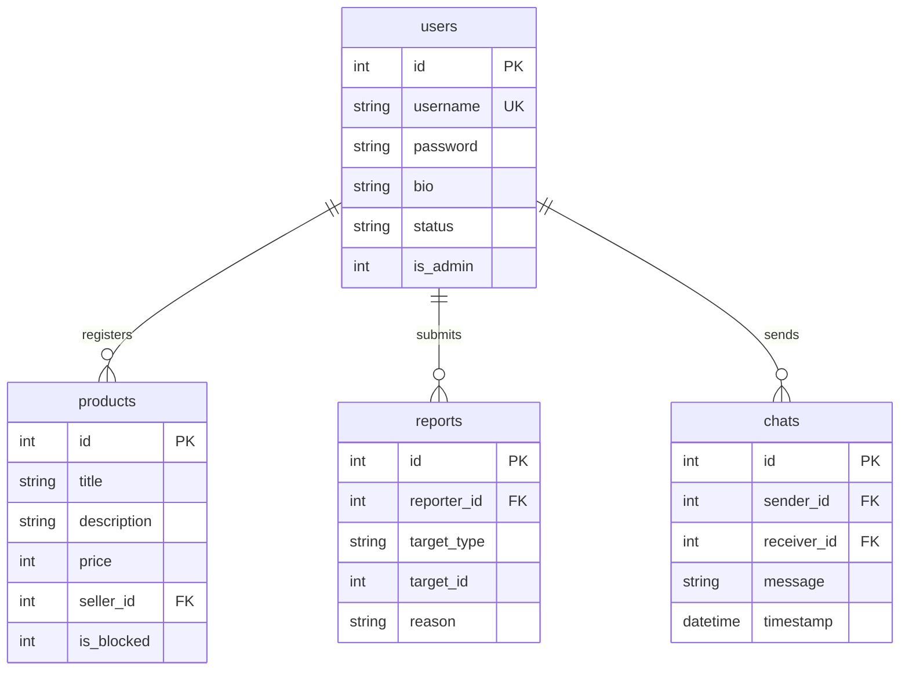

# [과제] 시큐어 코딩 기반 중고 거래 플랫폼 개발 보고서

본 프로젝트는 악성 유저 및 불량 상품 필터링 엔진과 실시간 소통 기능을 포함한 중고 거래 플랫폼 개발 과정 및 시큐어 코딩 적용 상세 내용을 기술합니다.

---

## 1. 프로젝트 개요 및 환경 구동 방법

### 1.1 개요
*   **주제**: 악성 유저 및 불량 상품 차단 기능과 실시간 소통 기능을 포함한 중고 거래 플랫폼 개발
*   **개발 단계**: 요구사항 분석, 시스템 설계, 구현(취약 버전 -> 보안 버전), 체크리스트 작성 및 테스팅, 유지보수 계획 수립
*   **배포 및 채점 환경**: Linux 환경 (Docker 및 Docker Compose 기반 구동 필수)

### 1.2 실행 방법 (단 한 줄의 명령어)
리눅스 터미널에서 프로젝트 루트 디렉터리로 이동하여 다음 명령어를 실행하면 즉시 환경이 구동됩니다:

```bash
docker-compose up --build
```

서비스가 가동되면 웹 브라우저에서 `http://localhost:5000`으로 접속하여 테스트할 수 있습니다.

---

## 2. 데이터베이스(RDBMS) 설계 (SQLite 기반)



### 2.1 테이블 상세 명세

1.  **사용자 정보 (Users)**:
    *   `id`: 기본키, 자동 증가
    *   `username`: 사용자 계정명, 중복 불가 (`UNIQUE`)
    *   `password`: 비밀번호 해시
    *   `bio`: 소개글
    *   `status`: 계정 상태 (일반 `active` / 휴면 `dormant` 전환)
    *   `is_admin`: 관리자 권한 여부
2.  **상품 정보 (Products)**:
    *   `id`: 기본키, 자동 증가
    *   `title`: 상품명
    *   `description`: 상품 설명
    *   `price`: 가격
    *   `seller_id`: 판매자 아이디 (외래키)
    *   `is_blocked`: 차단 여부 (신고 3회 이상 시 자동 차단)
3.  **신고 정보 (Reports)**:
    *   `id`: 기본키, 자동 증가
    *   `reporter_id`: 신고자 아이디 (외래키)
    *   `target_type`: 대상 타입 (유저 `user` / 상품 `product`)
    *   `target_id`: 타겟 아이디 (유저 또는 상품의 기본키)
    *   `reason`: 신고 사유
4.  **채팅 정보 (Chats)**:
    *   `id`: 기본키, 자동 증가
    *   `sender_id`: 발신자 아이디 (외래키)
    *   `receiver_id`: 수신자 아이디 (외래키, 공용 광장 채팅의 경우 `NULL`)
    *   `message`: 메시지 내용
    *   `timestamp`: 전송 시간

---

## 3. 핵심 보안 약점 구현 및 보안 대조 분석

본 플랫폼은 상단의 **보안 모드(Security Mode) ON/OFF 토글 스위치**를 통하여 동일 인풋 경로에서 취약점 동작과 방어 로직을 실시간으로 비교 검증할 수 있도록 설계되었습니다.

### 3.1 SQL Injection (SQL 삽입)
*   **취약 상태**: 사용자 입력을 살균(Sanitize)하지 않고 문자열 포맷팅(`f-string`)으로 직접 쿼리에 대입하여 악의적인 SQL 명령어가 쿼리 인터프리터에 의해 실행됩니다.
*   **시큐어 코딩 적용**: 매개변수화된 쿼리(Parameterized Query)를 사용하여 사용자 입력을 단순히 데이터 상수로 취급하여 쿼리 구조가 변조되지 않도록 원천 차단합니다.

| 구분 | 취약한 구현 코드 | 시큐어 코딩 적용 코드 |
| :--- | :--- | :--- |
| **로그인 검증** | `query = f"SELECT * FROM users WHERE username = '{username}' AND password = '{hashed_pass}'"`<br>`cursor.execute(query)` | `query = "SELECT * FROM users WHERE username = ?"`<br>`cursor.execute(query, (username,))` |
| **상품 검색** | `query = f"SELECT * FROM products WHERE (title LIKE '%{q}%' OR description LIKE '%{q}%') AND is_blocked = 0"`<br>`cursor.execute(query)` | `query = "SELECT p.*, u.username FROM products p JOIN users u ON p.seller_id = u.id WHERE (p.title LIKE ? OR p.description LIKE ?) AND p.is_blocked = 0"`<br>`cursor.execute(query, (f"%{q}%", f"%{q}%"))` |

---

### 3.2 XSS (Cross-Site Scripting, 크로스 사이트 스크립팅)
*   **취약 상태**: 상품 설명란에 사용자가 등록한 스크립트를 `|safe` 필터를 사용해 그대로 렌더링하거나, 채팅 수신 시 JavaScript의 `.innerHTML`을 이용해 여과 없이 브라우저 DOM에 주입하여 클라이언트 측 악성 스크립트 실행을 방치합니다.
*   **시큐어 코딩 적용**: 특수 문자(`<`, `>`, `&`, `"`, `'`)를 HTML 엔티티 코드로 변환(Html Escaping)하여 브라우저가 이를 스크립트 코드가 아닌 단순 텍스트로 인식하게 만듭니다.

| 구분 | 취약한 구현 코드 | 시큐어 코딩 적용 코드 |
| :--- | :--- | :--- |
| **상품 설명 렌더링** | `<!-- Jinja2 Template -->`<br>`{{ product.description \| safe }}` | `<!-- Jinja2 Template (자동 이스케이프) -->`<br>`{{ product.description }}` |
| **채팅 메시지 출력** | `// JS innerHTML 직접 바인딩`<br>`let text = msg.message;`<br>`bubble.innerHTML = text;` | `// HTML Entity 인코딩 함수 적용`<br>`let text = escapeHTML(msg.message);`<br>`bubble.innerHTML = text;` |

---

### 3.3 취약한 비밀번호 암호화 및 자동 업그레이드
*   **취약 상태**: 솔트(Salt)가 존재하지 않는 취약한 단방향 해시 알고리즘(MD5)을 사용하여 레인보우 테이블 매핑 및 대입 공격에 무방비하게 노출됩니다.
*   **시큐어 코딩 적용**: 난수화된 솔트가 포함된 강력한 알고리즘(PBKDF2/Bcrypt 등)으로 변경합니다. 특히, **기존 MD5 계정 유저가 보안 모드에서 성공적으로 로그인할 때, 실시간으로 안전한 암호화 해시로 자동 마이그레이션(Password Upgrade on Login)** 해주는 마이그레이션 기법을 탑재하였습니다.

| 구분 | 취약한 구현 코드 | 시큐어 코딩 적용 코드 |
| :--- | :--- | :--- |
| **회원 가입** | `hashed_password = hashlib.md5(password.encode()).hexdigest()` | `from werkzeug.security import generate_password_hash`<br>`hashed_password = generate_password_hash(password)` |
| **암호화 실시간 업그레이드** | (구현 부재 - 레거시 MD5 계속 사용) | `if not stored_password.startswith('pbkdf2:'):`<br>&nbsp;&nbsp;&nbsp;&nbsp;`if stored_password == md5_hash(password):`<br>&nbsp;&nbsp;&nbsp;&nbsp;&nbsp;&nbsp;&nbsp;&nbsp;`secure_hash = generate_password_hash(password)`<br>&nbsp;&nbsp;&nbsp;&nbsp;&nbsp;&nbsp;&nbsp;&nbsp;`db.execute("UPDATE users SET password = ? WHERE id = ?", ...)` |

---

### 3.4 IDOR (Insecure Direct Object Reference, 취약한 접근 제어)
*   **취약 상태**: 자원(자신의 정보, 게시글 삭제 권한 등)을 참조할 때, 요청 바디나 URL 인자에 기입된 ID 값을 신뢰하여 현재 로그인 세션 소유주와의 일치 여부를 검증하지 않습니다. 이로 인해 임의 변조 시 타인 상품을 임의 삭제하거나 다른 유저의 정보를 무단 변조할 수 있습니다.
*   **시큐어 코딩 적용**: 자원 엑세스 시 로그인 사용자 정보를 확인하고, 대상 오브젝트의 소유자(Seller ID 등)와 세션 사용자 정보를 철저하게 검증(Authorization Check)합니다.

| 구분 | 취약한 구현 코드 | 시큐어 코딩 적용 코드 |
| :--- | :--- | :--- |
| **마이페이지 수정** | `user_id = request.form.get('user_id')`<br>`db.execute("UPDATE users SET bio = ? WHERE id = ?", (bio, user_id))` | `user_id = session['user_id']`<br>`db.execute("UPDATE users SET bio = ? WHERE id = ?", (bio, user_id))` |
| **상품 글 삭제** | `// 검증 없이 파라미터 ID 즉시 삭제`<br>`db.execute(f"DELETE FROM products WHERE id = {product_id}")` | `prod = db.execute("SELECT seller_id FROM products ...", (product_id,))`<br>`if prod['seller_id'] == session['user_id'] or is_admin:`<br>&nbsp;&nbsp;&nbsp;&nbsp;`db.execute("DELETE FROM products WHERE id = ?")` |
| **채팅 내역 조회** | `// 쿼리 매개변수로 송/수신자 지정 및 엿보기 허용`<br>`s_id = request.args.get('sender_id')`<br>`r_id = request.args.get('receiver_id')` | `// 로그인 유저 세션으로 한 축 고정`<br>`my_id = session['user_id']`<br>`r_id = request.args.get('receiver_id')`<br>`db.execute("... (sender = my_id AND receiver = r_id) OR ...")` |


---

### 3.5 송금 기능의 복합 취약점 (IDOR & 비즈니스 로직 결함)
*   **취약 상태**: 송신자의 ID 정보를 세션이 아닌 클라이언트 인자에 의존하여 변조 가능한 **IDOR** 취약점이 존재합니다. 또한 금액에 대한 음수(-) 검증 및 잔액 한도 검증이 생략되어 음수를 송금해 돈을 강탈하거나 마이너스 통장처럼 무제한 송금하는 **비즈니스 로직 결함**이 존재합니다.
*   **시큐어 코딩 적용**: 송신자 ID를 `session['user_id']`로 강제 고정하고, 송금액이 0원 이하인지 검증하며, 송금자의 잔액 범위를 넘지 않도록 확인한 뒤 원자성(Atomicity)을 보장하는 데이터베이스 트랜잭션을 통해 이체를 실행합니다.

| 구분 | 취약한 구현 코드 | 시큐어 코딩 적용 코드 |
| :--- | :--- | :--- |
| **송신자 검증** | `sender_id = request.form.get('sender_id')` | `sender_id = session['user_id']` |
| **유효성 검사** | (검증 없음 - 마이너스 금액 및 초과 송금 가능) | `if amount <= 0: return error`<br>`if sender['balance'] < amount: return error` |
| **데이터 업데이트** | `db.execute(f"UPDATE users SET balance = balance - {amount} ...")` | `try:`<br>&nbsp;&nbsp;&nbsp;&nbsp;`db.execute("UPDATE users SET balance = balance - ? WHERE id = ?", ...)`<br>&nbsp;&nbsp;&nbsp;&nbsp;`db.commit()` |

---


## 4. 보안 체크리스트 및 테스팅 시나리오

### 4.1 진단 체크리스트
1.  **SQL Injection**: 로그인 아이디 란에 `' OR '1'='1` 입력 시 패스워드 없이 로그인이 우회되는가? -> 보안 모드 시 차단.
2.  **Stored XSS**: 상품 설명에 `<script>alert(1)</script>` 주입 후 상세 페이지 진입 시 알림창이 뜨는가? -> 보안 모드 시 단순 문자로 인코딩 처리.
3.  **DOM XSS**: 채팅창 메시지에 `` 주입 시 알림창이 동작하는가? -> 보안 모드 시 문자열 치환 완벽 차단.
4.  **Weak Password**: 회원 가입 후 DB 내 저장된 패스워드 포맷이 32자 MD5 단순 문자열 구조인가? -> 보안 모드 시 안전한 솔트 동반 해시 구조.
5.  **IDOR (Profile)**: 개발자 도구로 마이페이지 `user_id`를 `2`로 변조 시 다른 유저 정보가 수정되는가? -> 보안 모드 시 현재 세션 유저만 업데이트 처리.
6.  **IDOR (DM Leak)**: 채팅 화면 내 도청 장치(API 매개변수 변조)로 타인 간의 1:1 대화 내역이 유출되는가? -> 보안 모드 시 타 세션 DMs 열람 원천 차단.
7.  **송금 복합 취약점**: 송신자 ID 및 음수(-) 금액 송금 시 상대방의 돈이 탈취되거나 한도 없이 마이너스 송금이 가능한가? -> 보안 모드 시 0원 이하 및 잔액 초과 송금 차단 및 송신자 세션 고정.


### 4.2 테스트 가이드 (채점 방법)
1.  **로그인 우회 테스트**:
    *   **취약 모드: ON** 확인 후, 아이디 창에 `admin' --` 입력, 패스워드는 아무 값이나 채우고 로그인 시도 -> 즉각 admin 로그인 성공.
    *   **보안 모드: ON**으로 토글 후 동일 입력 로그인 시도 -> 로그인 실패 처리 확인.
2.  **상품 검색 SQL Injection**:
    *   **취약 모드: ON**일 때 상품 검색창에 `' UNION SELECT 1, username, password, 4, 5, 0 FROM users --` 검색 시 전체 사용자의 비밀번호 해시 유출 확인.
    *   **보안 모드: ON**일 때 문자열이 그대로 바인딩되어 검색결과 0건 처리 확인.
3.  **XSS 경고창 테스트**:
    *   스팸 계정(`spammer`)이 등록한 상품 상세 페이지 접근 시 스크립트 가동 여부를 모드별로 대조 관찰.
4.  **1:1 채팅 도청 테스트**:
    *   로그인 후 실시간 채팅 메뉴로 진입, 하단 **"IDOR DM 도청 장치"**에 송신자 `2`, 수신자 `3` 입력 후 "패킷 가로채기" 클릭 -> 취약 모드 시 seller1과 buyer1의 대화 내용이 도청됨. 보안 모드 시 조회 불가.
5.  **실시간 송금 취약점 테스트**:
    *   `buyer1` 계정으로 로그인 후 **실시간 송금** 메뉴로 이동합니다.
    *   **취약 모드: ON**일 때, 송신자 ID를 `2`(seller1), 수신자를 `3`(나 자신)으로 설정하고 50,000원을 이체하면 타인의 자금이 나에게 송금됩니다(IDOR). 또한 금액에 `-30000`을 입력하고 이체하면 오히려 내 돈이 늘어나고 상대방 돈이 차감됩니다(음수 송금 로직 결함).
    *   **보안 모드: ON**으로 설정 시 이러한 불법 송금 요청 및 음수 이체 시도가 차단됨을 확인합니다.

---


## 5. 유지보수 계획 및 시스템 확장 방안

1.  **세션 보안 설정 고도화**:
    *   세션 쿠키 설정에 `HttpOnly`, `Secure`, `SameSite=Strict` 옵션을 활성화하여 자바스크립트를 통한 세션 탈취를 방지합니다.
2.  **안전한 암호 규격 강제 및 솔트 업그레이드**:
    *   로그인 과정에서의 실시간 비밀번호 업그레이드 마이그레이션 기법을 통하여 레거시 MD5 및 단순 SHA256 암호값을 무중단 전수 최신 해시로 자동 변환 처리합니다.
3.  **WAF (웹 방화벽) 연동**:
    *   웹 방화벽 보안 룰셋을 정의하여 유해 SQL 키워드 및 HTML 인젝션 유발 특수 문자열을 유입 이전에 탐지/드롭시킵니다.
4.  **역할 기반 권한 제어 (RBAC) 및 보안 데코레이터 적용**:
    *   세션의 특정 권한 필드를 검증하는 커스텀 라우트 데코레이터(`@login_required`, `@admin_only`)를 통해 휴먼 에러로 인한 인가 누락을 미연에 봉쇄합니다.